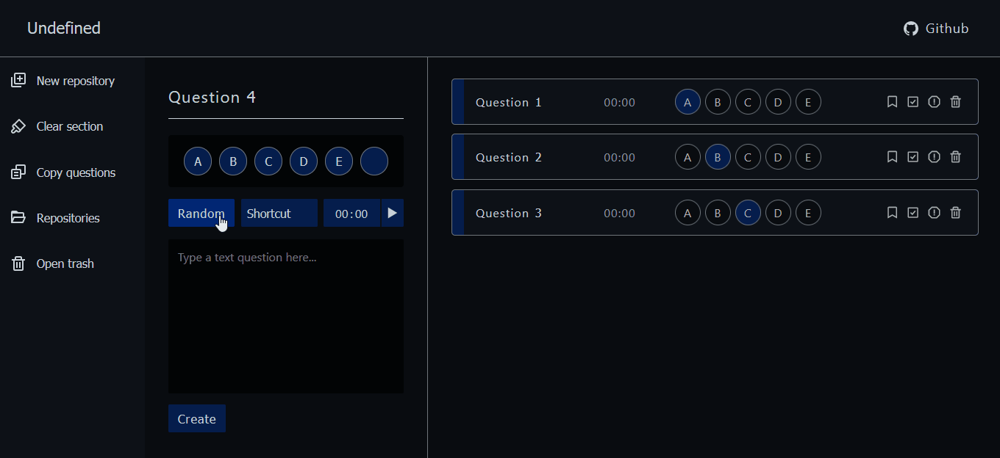

 

<h1 align="center">Question helper</h1>

Plataforma desenvolvida para salver o gabarito de provas e atividades durante o EAD. Tem como objetivo suprir as dificuldades das provas online, visto que, muitos plataformas não salvam os dados, dessa forma, em uma possível queda de energia ou eventual problema que exija um recarregamento da pagina, todos as respostas são perdidas. Ademias, a plataforma permite salvar os gabaritos em repósitórios, permitindo a arquivação dos dados de forma mais organizada.

 <a href="#motivacao">Motivação</a> |
 <a href="#solucoes">Suluções</a> |
 <a href="#compatibilidade">Compatibilidade</a> |
 <a href="#estrutura">Estrutura</a>

<h4 align="center"> 
	🚧  Under construction...  🚧
</h4>

## Motivação

Durante o EAD, a minha escola contratou uma plataforma para as aulas, contudo, as avaliações e atividades apresentavam alguns problemas. Primeiramente, o tempo de carregamento era relativamente elevado, em que, devido ao tempo restrito de avaliação, esse "delay" causou um pouco de frustração no meu caso, prejudicando diretamente a minha nota.

Ademais, as questões não eram salvas altomaticamente, dessa forma, era necessário salvar cada questão antes de passar para a próxima questão. O problema é que, em muitos casos, eu esquecia de salvar. Consequentemente, eu precisso fazer a mesma questão várias vezes. Da mesma forma, as ocilações na internet impossibilitavam o carregamento da questão seguinte.

### Suluções

A plataforma é uma solução mais prática e com um design melhor que um arquivo ".txt", dessa forma, eu utilizei a API do Browser IndexedDB como banco de dados e o React JS como Front-end. O Banco de dados é local, dessa forma é considerávelmente rápido e cada input é salvo em tempo real no localStorage.

Com o objetivo de almentar a velocidade, cada questão é renderizada separadamente pelo react e adcionada pelo DOM. Uma outra alternativa seria utilizar o useState do React, porém, a cada questão adcionada, o React renderiza todas as questões, almentanndo muito o tempo de carregamento em um grande número de questões.
Como a plataforma deveria funcionar offline, optei por utilizar a indexedDB, uma API para armazenamento client-side de quantidades significantes de informações e buscas com alta performance por índices.

Os imputs tambem são controlados pelo DOM, pois como os inputs são alterados pela Navbar, o componente pai mais próximo é o próprio app, dessa forma fica infiável acessar um useState de um componente tão distante.

### Compatibilidade

A plataforma foi desenvolvide no FireFox, dessa forma, pode apresentar bugs e problemas em outros navegadores, esprecialmente no css. Apenas o Internet Explorer não apresenta compatibilidade com o indexedDB, impossibilitando o uso.

Ainda não desenvolvi o layout de outros tamanhos de monitor e mobile.

## Estrutura

- Components: componentes renderisados pelo react
- Data base: inicia e conecta com a IndexedDB
- Storage: funções que conectam o DOM com a database
